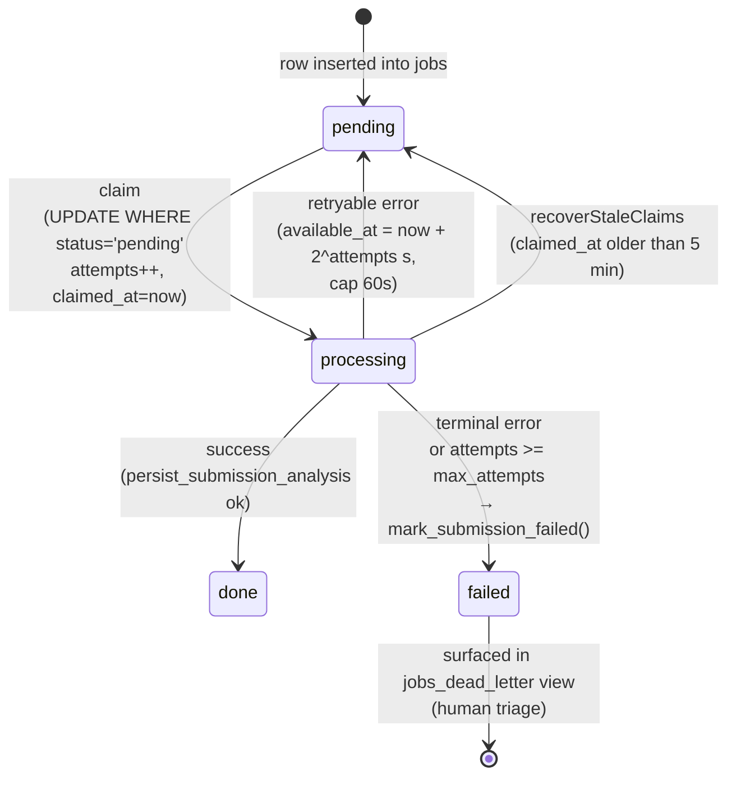

# Architecture

## End-to-end narrative

A user POSTs free-form English text to
[`/api/v1/submissions`](../app/api/v1/submissions/route.ts). The
route resolves the caller via `requireUserContext`
([`lib/auth/user.ts`](../lib/auth/user.ts)), runs two rate-limit
checks (`check_and_consume_rate_limit` RPC — per-day, then
per-hour — defined in
[`supabase/migrations/20260510000000_init.sql`](../supabase/migrations/20260510000000_init.sql)),
and inserts a row into `public.submissions` using the user-scoped
client (so RLS stamps `user_id`). The response is `201` with a
`submissionId`; analysis is asynchronous from the user's
perspective.

On production, the **Supabase Database Webhook** configured against
`INSERT INTO public.submissions` fires a `POST` to
[`/api/v1/internal/webhooks/supabase-submission`](../app/api/internal/webhooks/supabase-submission/route.ts).
That route authenticates the bearer secret in constant time,
validates the payload with a Zod schema, returns `200` immediately,
and uses Next.js `after()` to run the analysis pipeline in the
background within Vercel's `maxDuration`. The polling worker at
[`workers/process-jobs.ts`](../workers/process-jobs.ts) is retained
for local development and as a fallback, but the production path is
webhook-driven.

The analysis pipeline runs in
[`lib/services/process-submission.service.ts`](../lib/services/process-submission.service.ts).
It makes **LLM call #1** (`analyzeSubmissionText`,
[`lib/services/analysis.service.ts`](../lib/services/analysis.service.ts))
to get a corrected text and up to 20 issues with strict JSON schema
output, normalizes each issue's category/text into a canonical key
via
[`lib/normalization/normalize-issue.ts`](../lib/normalization/normalize-issue.ts),
selects up to 2 high-confidence "card-worthy" issues, and makes
**LLM call #2** per selected issue
(`generateCardCandidates`,
[`lib/services/card-generation.service.ts`](../lib/services/card-generation.service.ts))
to draft up to 3 review-card candidates each.

Everything lands in a single transaction through the
`persist_submission_analysis` RPC
([`supabase/migrations/20260517100600_learning_targets_merge.sql`](../supabase/migrations/20260517100600_learning_targets_merge.sql)).
The RPC is `SECURITY DEFINER`, service-role-only, and inserts the
`analyses` row, the `analysis_issues`, upserts `learning_targets`
keyed by `(user_id, canonical_key)` (following any
`merged_into_id` chain), writes `learning_target_evidence`, inserts
`cards`, seeds `srs_state`, and flips `submissions.status` to
`analyzed`.

Review happens via
[`/api/v1/review-queue`](../app/api/v1/review-queue/route.ts) (due
active cards from `srs_state`, filtered by RLS) and
[`/api/v1/reviews`](../app/api/v1/reviews/route.ts), which after an
RLS ownership check calls `record_review`
([`supabase/migrations/20260521100000_record_review_mastery_status.sql`](../supabase/migrations/20260521100000_record_review_mastery_status.sql)).
That function performs SM-2 math under `FOR UPDATE`, writes a
`reviews` row, updates `srs_state` (repetition, interval,
ease_factor, lapse_count, due_at), leech-suspends the card at
`lapse_count ≥ 8`, and updates `learning_targets.status` to
`mastered` / `mastering` / `active` based on the aggregate state
of its active cards. The display-time mastery level is recomputed
on the fly by `computeMasteryLevel`
([`lib/srs/mastery.ts`](../lib/srs/mastery.ts)).

## Data flow

```mermaid
flowchart TD
    Browser["Browser (JWT)"]

    subgraph Vercel["Vercel — Next.js"]
        Submit["/api/v1/submissions<br/>(user client, RLS)"]
        Webhook["/api/internal/webhooks/supabase-submission<br/>(service-role, after())"]
        Reviews["/api/v1/reviews<br/>(user check → service-role RPC)"]
        Queue["/api/v1/review-queue<br/>(user client, RLS)"]
        Worker["workers/process-jobs.ts<br/>(dev/fallback)"]
    end

    subgraph Supabase["Supabase Postgres"]
        Submissions[("submissions")]
        Jobs[("jobs<br/>(inert on prod path)")]
        Analyses[("analyses · analysis_issues")]
        LTs[("learning_targets · evidence")]
        Cards[("cards · srs_state")]
        ReviewsTable[("reviews")]
        DeadLetter[/"jobs_dead_letter<br/>(view)"/]
        RateLimits[("rate_limits")]
        Persist{{"persist_submission_analysis<br/>SECURITY DEFINER<br/>service-role only"}}
        Record{{"record_review<br/>SECURITY DEFINER<br/>service-role only"}}
        RateRPC{{"check_and_consume_rate_limit<br/>SECURITY DEFINER"}}
    end

    OpenAI["OpenAI Responses API"]

    Browser -->|POST text| Submit
    Submit -->|rate_limit RPC| RateRPC
    RateRPC --> RateLimits
    Submit -->|insert| Submissions
    Submissions -.->|INSERT trigger<br/>(Supabase webhook)| Webhook
    Webhook -->|analyzeSubmissionText| OpenAI
    Webhook -->|generateCardCandidates| OpenAI
    Webhook -->|RPC| Persist
    Persist --> Analyses
    Persist --> LTs
    Persist --> Cards
    Persist -->|status='analyzed'| Submissions

    Browser -->|GET due| Queue
    Queue --> Cards

    Browser -->|POST rating| Reviews
    Reviews -->|ownership read| Cards
    Reviews -->|RPC| Record
    Record --> ReviewsTable
    Record --> Cards
    Record --> LTs

    Worker -.->|claim / fallback| Jobs
    Jobs --> DeadLetter
```

**Boundaries to notice:**
- The browser only ever talks to Vercel routes via JWT; it never
  reaches Supabase RPCs directly.
- `persist_submission_analysis` and `record_review` are revoked
  from `anon` and `authenticated`. The service-role client (used by
  the webhook handler and the worker) is the only caller. They
  still verify ownership defensively inside the function bodies.
- The `jobs` table and `jobs_dead_letter` view remain on the
  schema but receive no new inserts from the application path —
  they're retained as fallback infrastructure for the polling
  worker (`workers/process-jobs.ts`).

## Jobs lifecycle (fallback worker)

The webhook trigger is the production path; this lifecycle applies
only when running `workers/process-jobs.ts` (local dev, manual
backfill, or as a future fallback).



**Concurrency safety:** the claim is an optimistic `UPDATE … WHERE
status='pending'`, so multiple workers can run safely — only one
will win each claim. `recoverStaleClaims` is idempotent and cannot
inflate `attempts` (those only bump at claim time), so a crashed
worker's jobs return to `pending` without retry-counter pollution.

**Dead-letter view:**
[`supabase/migrations/20260521100300_jobs_dead_letter_view.sql`](../supabase/migrations/20260521100300_jobs_dead_letter_view.sql)
defines `public.jobs_dead_letter` as the read surface for failed
jobs (service-role / admin only). See
[`docs/RUNBOOK.md`](RUNBOOK.md) for the manual requeue procedure.
